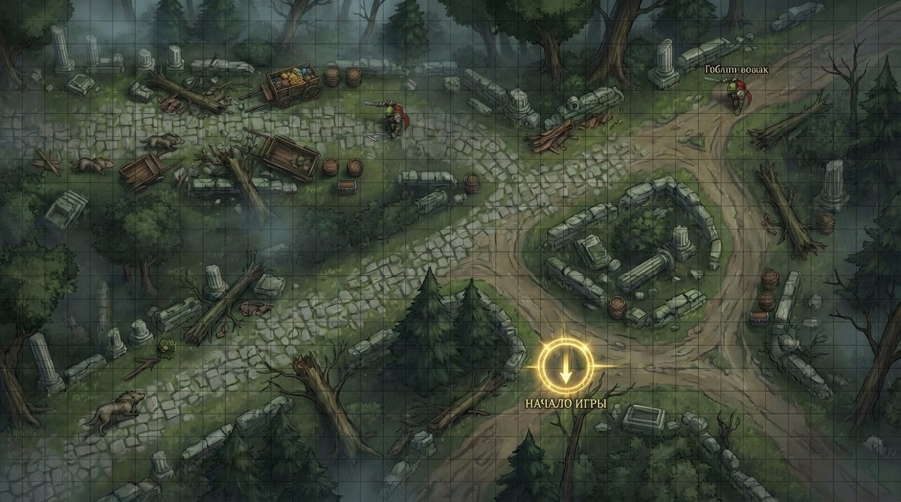

# Taloria RPG

**Cooperative online RPG with an AI game master.** Players create heroes, gather in a city lobby, and run missions together — while an LLM narrates the story, reacts to their actions and drives the scenario.

Live: [taloria.ru](https://taloria.ru)



## Features

- 🎲 **AI game master** — LLM-driven narration (Claude via OpenRouter): scenario progression, reactions to player actions, mission storytelling
- ⚔️ **Game engine** — turn-based combat, abilities, status effects, pathfinding, loot generation
- 🧙 **Heroes** — classes, character creation, inventory, crafting recipes
- 🏙 **City** — lobby, NPC shops, bestiary, trade offers between players, wallet ledger
- 👥 **Multiplayer** — realtime game sessions over WebSocket, chat
- 🛠 **Admin panel** — content management: monsters, items, maps, scenarios, ability templates

## Stack

- **Client**: TypeScript + Vite, screen-based SPA (no framework), WebSocket
- **Server**: Node.js + Express, MongoDB (Mongoose), JWT auth, rate limiting
- **AI**: OpenRouter (Anthropic Claude), narration persisted per session
- **Infra**: Docker Compose

## Run locally

```bash
cp server/.env.example server/.env   # fill in MONGODB_URI, JWT_SECRET, OPENROUTER_API_KEY
docker compose up --build
```

## Author

Vyacheslav Egorov — [@egorovslava](https://t.me/egorovslava) · [github.com/egor0v](https://github.com/egor0v)
